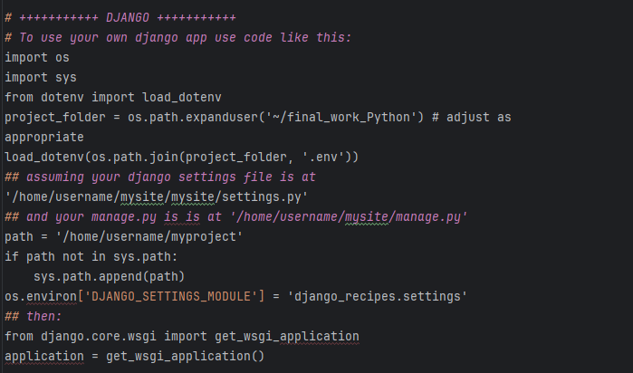
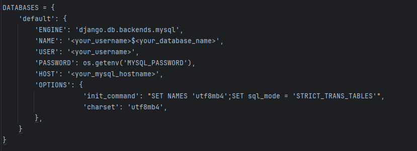
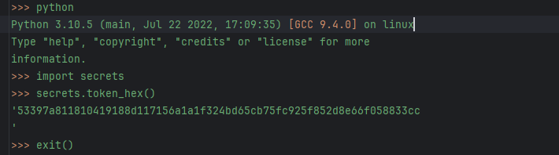
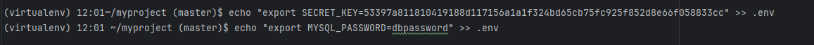
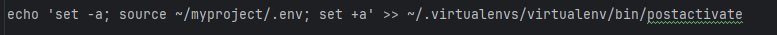
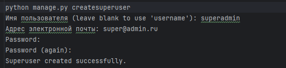

Проект “Сайт рецептов” на Django
Данный проект является реализацией итоговой аттестации по программе “Вебразработка на Python” 
и представляет собой веб-приложение для хранения и просмотра рецептов. Пользователи могут добавлять, 
просматривать, редактировать и удалять рецепты, а также просматривать рецепты других пользователей.

Установка

В первую очередь выключаем режим отладки
DEBUG = False

Тут же добавим две константы. Так мы повышаем безопасность работы с сессиями и
с csrf токенами
SESSION_COOKIE_SECURE = True
CSRF_COOKIE_SECURE = True

И секретный ключ. Его стоит хранить не в файле настроек, а в переменных
окружения. Поэтому заменяем строку с ключом от Django на следующие пару строк:

import os
...
SECRET_KEY = os.getenv('SECRET_KEY')

Сгенерируем и добавим секретный ключ в переменные окружения чуть позже.
Настройки доступа
Также добавим адрес сайта в список доступных хостов:

ALLOWED_HOSTS = [
'127.0.0.1',
...
'username.hosts',
]

Клонируйте репозиторий на ваше устройство:

git clone https://github.com/Alhafat/final_work_Python

После завершения клонирования остаёмся в консоли, запускаем команду на создание виртуального окружения:

mkvirtualenv --python=/usr/bin/python3.10 virtualenv

Активация виртуального окружения происходит автоматически после создания. Не закрывая консоль устанавливаем необходимые 
пакеты:
cd myproject

Установите зависимости:
pip install -r requirements.txt

В первую очередь находим раздел Virtualenv и указываем путь до созданного нами окружения:
/home/username/.virtualenvs/virtualenv

Теперь отредактируем wsgi файл.
У вас должно получится примерно следующее:

Создайте базу данных MySQL и настройте соединение с базой данных в файле settings.py.

Сохраним “секреты” в окружении
Для начала создадим секретный ключ. Для этого в консоли запускаем
интерпретатор Python и воспользуемся функцией token_hex из модуля secrets

Копируем токен и выходим из режима интерпретатора командой exit()
Проверяем, что мы находимся в той же директории, что указана в wsgi файле в для
переменной project_folder. Если нет, переходим в нужный каталог и выполняем
команды добавления “секретов”:

Следующий этап - создать таблицы в базе данных MySQL на основе миграций.
Для начала научим консоль работать с “секретами”. Введём команду

Примените миграции базы данных:

python manage.py migrate

Раздача статики сервером
Нам снова понадобится консоль. Если вы не закрывали её после создания
миграций, продолжаем работать в ней. Соберём статические файлы проекта и
приложений в одном месте. Для этого выполним команду:

python manage.py collectstatic

В поле URL запишем /static/. Это содержимое нашей константы STATIC_URL в
настройках проекта. В поле Directory введём абсолютный путь до каталога со
статикой. Его нам сообщил Django как результат работы команды collectstatic.
Скорее всего это путь /home/username/myproject/static
Перезагружаем сервер, статика должна начать автоматически раздаваться.

Для создания суперпользователя:

Теперь проект готов для запуска и работы на сервере.

Для запуска на локальном сервере необходимо изменить отменить начальные настройки в файле setting.py
Команда для локального запуска:

python manage.py runserver

Откройте ваш веб-браузер и перейдите по адресу http://localhost:8000/, чтобы начать использование приложения.

Функции
Регистрация и аутентификация пользователей
Просмотр главной страницы с рецептами кратко
Просмотр подробной информации о рецепте
Добавление, редактирование и удаление рецептов (возможно только авторизованным автором или администратором сайта)
Возможность добавления нового или удаления  изображения для рецепта (возможно только авторизованным автором или администратором сайта)
Категоризация рецептов (добавление, изменение, возможно только авторизованным автором или администратором сайта)

Технологии:
Python
Django - фреймворк для разработки веб-приложений
MySQL - СУБД для хранения данных
JavaScript - для добавления интерактивности и динамического поведения
HTML/CSS - для создания пользовательского интерфейса

Проект развернут по адресу :

https://alhafad.pythonanywhere.com/
